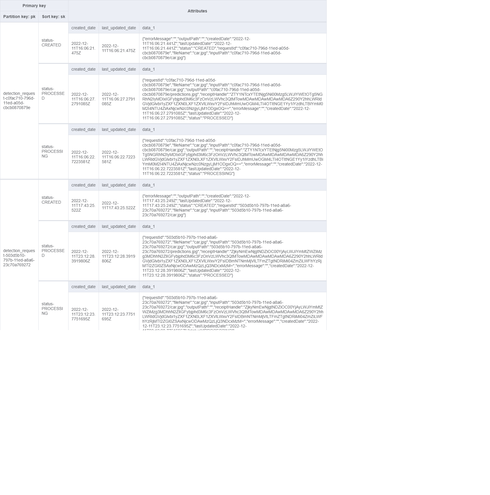

# Gotcha-Rest: AWS Serverless App demo in Node, Fasitfy, and React on lambda, using SQS, S3, DynamoDB

## Summary

A serverless rest api demo that mostly use [fastify](https://www.fastify.io/) and [aws-lambda-fastify](https://github.com/fastify/aws-lambda-fastify) on lambda, it provides an endpoint to receive images and return a requestId, then it will send the image to S3, send a messge to sqs queue, and store related status to DynamoDB. The message and image will be picked up and pcossed by [Gotcha-Ai-Worker](https://github.com/liang121900/gotcha-ai-worker) which willupload an output image with object detected on S3, and update the status to PROCESSED on dynamoDB. The user can use another endpoint to get the process status by the requestId and get the result image once the status becomes PROCESSED.

To better demonstrate what this app does, a [React](https://reactjs.org/) front end was added.

It can be accessed on https://gotcha-dev.ga. 

Note the react app is served by the same lambda function for simplicity, but for production or larger amount of traffic, it should be refactored e.g. be hosted on a S3 bucket.

## General Flow Diagram


## Core functionality Demo


## Postman Collection
There is a [postman collection](./doc/postman/gotcha-ai.postman_collection.json) on doc folder for example request.

## DynamoDB table schema:



## Running locally
If need to connect to aws service locally, you can use localstack.
Run the [script](https://github.com/liang121900/gotcha-ai-worker/blob/master/local/create-local-aws-resource.py) to create the resource on localstack, and run the [gotcha-ai-worker](https://github.com/liang121900/gotcha-ai-worker) to create the dynamoDB locally with the expected schema.
Otherwise, simply update .env file to the url on cloud instead of localhost.

# Getting Started with [Fastify-CLI](https://www.npmjs.com/package/fastify-cli)
This project was bootstrapped with Fastify-CLI.

## Available Scripts

In the src directory, you can run:

### `npm run dev`

To start the app in dev mode.\
Open [http://localhost:3000](http://localhost:3000) to view it in the browser.

### `npm start`

For production mode

### `npm run test`

Run the test cases.

## Learn More

To learn Fastify, check out the [Fastify documentation](https://www.fastify.io/docs/latest/).

# AWS SAM:
## To Deploy (**TODO**, create a makefile to automate this, set the request throttling on sam template.)
### If there's only changes on the react app, might need to delete the .aws-sam folder, because sam might not detect the changes.
1. Build the app by running 

```sam build --config-file .\samconfig.toml```

2. Build the react app on /ui folder by running

```npm run build```

3. Copy the generated **ui/build** folder on step #2 to **.aws-sam/build/FastifyApp/ui/build** generated on step #1, then delete all files and folders except the **build** folder
4. Run sam deploy to deploy to aws.

```sam deploy --config-file samconfig.toml --profile default --region us-east-1```

5. Create a zip file from .aws-sam and upload to lambda page, so that the last-modifed and create date of the file still present. Looks like sam will remove them when packaging.
6. On aws console -> api gateway, check if settings -> Binary Media Types have been reset, if so, add */* and multipart/form-data, TODO: add this setting to the SAM template.

```Deploy the react app to s3```
1. Build the app on the ui folder
2. go to ui\build and run the command to upload the files, aws s3 sync . s3://gotcha-static-web-dev

```Cloud Front setup```
1. Create a cloud front distribution and add the 2 origins: S3 and Api gateway created above (for the api gateway origin, add "/Prod" on the origin path)
2. Create two behaviors on the distribution for path patterns with /api/*, route that to the api gateway origin, and default route to the S3 orign.
